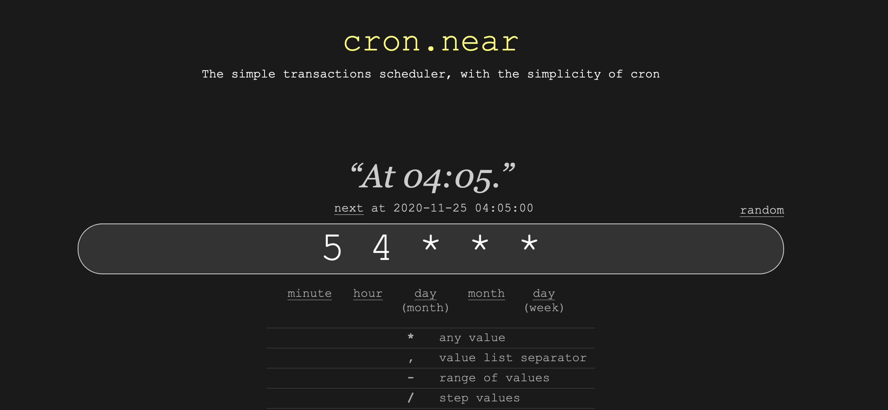

- Proposal Name: Cron.Near
- Start Date: 2020-11-20
- Authors(s): Mike Purvis (@mikedotexe), Trevor C. (@trevorjtclarke)

# Summary
[summary]: #summary

Core goal of Cron is to provide a general access, fully autonomous contracts that enable scheduled function calls for blockchain contract execution. Today, there are many use cases that could benefit from recurring or scheduled jobs that are triggered to execute in a trustless manner. 

With Near Cron, we aim to allow any contract to be able to schedule some logic to get executed in the future, once or many times, triggered by an approved party or directly via protocol, in an economically stable format.

Cron.Near is not a new concept, it is an implementation of blockchain executable functionality based on the popular module [Cron](https://en.wikipedia.org/wiki/Cron) available in many programming languages.

# Motivation
[motivation]: #motivation

Many contract functionalities need an extra execution step to enable the completion of some action or state finalization. Without a cron-style execution, contracts on chain must rely on externally provided state & function changes via transactions sent by chain participants. This is a critical logic piece that is innefficient and sometimes expensive for the participant. Such execution could be paid for by the contract (if desired) or made to execute with less logic (cheaper) by not needing to alter large amounts of chain storage.

> Cron is the missing functionality required for contracts to operate as a fully autonomous entity.

Near Cron can best be explained by how it would be used in the following use cases:

## 1. Contract Subscription Payments

Most SaaS business models rely on subscription based payments to provide a profitable service. Subscription models usually prompt the customer to accept terms where they will get charged some amount recurring over some time period. At the end of each period, the customer is charged the agreed upon amount based on a standard amount or based on usage.

#### **Example:**

SaaS Business **Beets Baskets** provides a monthly subscription to receive a digitally rare Beet vegetable and has a token **$ShruteBux** that users buy to be a part of this product. Each month, if the user has enough funds, they are sent a digitally unique Beet and some amount of **$ShruteBux** needs to be paid.

#### **Without Cron.Near**

SaaS business needs to notify each user to send a payment, similar to an invoice, before they receive that months product. This works only if the user follows through and submits the transaction. If the user forgets, the SaaS business loses future interactions & benefit from ongoing usage.

#### **With Cron.Near**

SaaS business sets up a function in their **DnaDwight** contract, that is called every month to compute active users that should be charged and change the users balance (or claim some amount of another token). This allows the SaaS business contract to enforce the subscription terms agreed upon when the user signed up to the service, and the user can then cancel at a future time.

## 2. Auctions & Prediction Markets

To finalize on chain outcomes requires one or several parties to compute the final state of data. Without finalizing an auction, assets are locked until some action is completed. Without finalizing a prediction set, participants cannot claim any won rewards.

#### **Without Cron.Near**

Participants need to spend transaction fees to finalize the outcome of auctions/predictions, which can be costly depending on the outcome logic of the contract. This is especially not good for outcomes where the fees are more expensive than the outcome / rewards / assets.

#### **With Cron.Near**

In most cases, auctions & prediction markets have a deadline or finalization criteria. Cron can be used to trigger a "finalization" function which enables all participants to know the outcome upon deadline completion without any participant action required. An auction winner would receive assets, and auction losers would regain locked funds. Prediction market winners would receive all rewards without having to request via transaction.

## 3. Rebasing tokens

Stable token economics are difficult to achieve. One way to create a "market stabilizing" effect, is to mint/burn token supply relative to the amount of circulating supply needed by demand. A live example is [Ampleforth](https://www.ampleforth.org/).

#### **Without Cron.Near**

The rebase token owner needs to total the supply needed each day based on demand and submit a transaction to mint or burn tokens to change total supply. In some cases, adjustments also need to be made for token holders. This update is submitted by an external party that has ownership over the contract -- which infers that any amount of tokens can be minted/burned to some extent outside of user expectations.

#### **With Cron.Near**

Token rebase can occur every block, epoch, day, month -- the contract can update supply autonomously, trustlessly, based on contract logic alone. This allows the contract itself to be autonomous, without ownership, so all economic adjustments can meet user expectations.

## 4. Voting & Governance

Decentralized Autonomous Organizations (DAOs) are becoming well known for their ability to coordinate community incentivized activity. A few good examples are: [MakerDao](https://makerdao.com/en/), [Aragon](https://aragon.org/), [MetaCartel](https://www.metacartel.org/ecosystem), [DAO Stack](https://daostack.io/).

#### **Without Cron.Near**

Finalizing vote outcomes and governance proposals requires a DAO admin to send a transaction to execute the update. This inherently requires the entire DAO community to trust a single or few individuals to finalize outcomes. Depending on the DAO structure & economics, this could be related to a large amount of assets allocation & usage.

#### **With Cron.Near**

Voting and governance outcomes can be finalized upon the ending of a deadline; tallying the votes and storing final totals in contract storage, acknoledging proposal participation and allocating any resources needed by proposal submission requirements approved/denied by DAO community.

## 5. Triggers & IFTTT Style Contracts

Decentralized Finance has been compared to Legos, where contracts can be built upon other contract's features, creating a larger functionality with less duplication. The great thing is when contract functionality can be triggered autonomously when something changes on-chain in another contract. [Gelato.network](https://gelato.network/) and [EPNS](https://epns.io/) are good examples.

#### **With Cron.Near**

A user can create a contract with periodic checks on other contracts/logic. Developers could also create contracts with general purpose functionality users can subscribe to get triggered with Cron, based on their own custom timing requirements. Cron is flexible enough to handle many triggering parameters.

## 6. Contract Storage Reclaiming/Garbage Collection

Near blockchain has a unique mechanism for allowing contracts to remove state and reclaim valuable storage, which in turn is cheaper for the contract to cover ongoing storage cost.

#### **With Cron.Near**

Contracts could utilize Cron to schedule regular cleanup state tasks, that help the contract stay economically stable. More state is more expensive, putting the users at risk for carrying this burden over time. Cron gives contracts the ability to maintain the amount of state it can afford.

## 7. Rewards & Staking

Near blockchain staking contracts and many DeFi token platforms (Uniswap, Aave, etc) utilize staking tokens to help encourage economic stability and growth. In most cases, the user is responsible to taking the action to remove, update, or manage their staked tokens. For each interaction the user is required to pay a transaction fee to do simple things like re-staking. This does not encourage more usage, and could be done by the contract for all active users.

#### **With Cron.Near**

The contract could automatically compute active stake amounts, distribute rewards, enable compounding functionality to balances, reward small time stakers by handling the transaction fees during a bulk re-compute event.

## 8. State Channel Watchtower

Similar to voting, Dispute / Resolution features of a state channel require an external party to validate submitted data against a set of rules. State channel rules can live within a contract that is used by state channel participants.

#### **With Cron.Near**

Upon each state channel chain update (snapshot or close), the state & transaction rollup gets added to the chain. Cron could be used to periodically confirm state channel updates, run rules to test for disputes and run resolution logic.

### Further Possibilities

The use cases seem endless for cron, when there is some functionality that needs execution beyond the context of a single transactions maximum execution threshold (which is limited econmically by gas). We would love to see what you can come up with that utilizes Near Cron!

Upon spec finalization and implementation, we expect to enable developers to use a simple yet powerful set of chain-based methods for Cron functionality. See below for technical details.

# Cron Usage Guide
[guide-level-explanation]: #guide-level-explanation

## For Contract Developers

Answer the following question:
> Does your contract or app require regular automated calls for some functionality?

If your answer was **YES**, then let's get you started using Cron.Near!!

### Quick Start

Using Cron.Near requires knowledge of [Cron](https://en.wikipedia.org/wiki/Cron) spec, which enables you (the developer) to specify how often a certain function gets called.
You can think of Cron as a simple formula:

    Cron = execution time + function to call

When a contract tells Cron which function to call when/how often, this is a Cron Task!

Let's look a few quick examples of how a contract would utilize cron end-to-end

### Initialization: Scheduling

A contract needs to tell Cron what to trigger when -- this is what we call "Scheduling". To schedule future single or multiple calls, contracts can follow this code example:

```rust
// TBD: cron::schedule(&mut self, cron_time: string, contract_id: string, func_sig: string, recurring: bool)
```

When your contract calls `schedule`, cron now knows how to call your contract in the future. There is 1 last step that needs to happen -- _Permissions_.

### Function Execution Permissions

To enable your function to get called, Cron needs to get access & payment to execute. This allows your contract to execute trustlessly by only providing an external party to call only what you want, one time, and without any fees on the external party.

```rust
// TBD: 
```

### Status & Payments

Viewing and maintaining contract cron tasks requires contract owners to maintain enough balance for their contract to continue getting triggered. Since cron tasks are executed by 3rd parties, they expect a small fee for doing this task for you. 

```rust
// TBD: 
```

### Removing Tasks

When you've completed all recurring tasks, your contract or contract owner can cancel a task by using the following example:

```rust
// TBD: cron::cancel(& mut self, contract_id: string, func_sig: string, reimbursement_acct_id: string)
```

This will remove all future calls and return any/all payment balances held in escrow for execution payments. NOTE: this will **not** remove any pending transactions, it will simply stop more function triggers from getting called.

----

## For Cron Task Runners

If you have a reliable server, ready to run a docker instance with less than 0.1% downtime, you are elligible for earning revenue by executing cron tasks.

### TBD -- TC finish!

* docker pull cron-near/task-manager
* docker up -d
* near call 

NOTE:S
* docker needs to hold a small amount of NEAR to pay for signing txns
* docker needs to view/poll from the contract to check if new task
* docker needs to trigger the cron contract to trigger registered task contract
* docker initially registers with its node account id (the one making the payment), public key of node, beneficiary account id (for rewards upon success of task)

NOTE NOTE:
* Rewards: MVP will return immediately in the callback, could we do batching of rewards to take less fees overall?

# Cron Reference
[reference-level-explanation]: #reference-level-explanation

Near is specially suited to handle this type of functionality since it has access keys provided at the core, allowing for a pr

This is the technical portion of the NEP. Explain the design in sufficient detail that:

- Its interaction with other features is clear.
- It is reasonably clear how the feature would be implemented.
- Corner cases are dissected by example.

The section should return to the examples given in the previous section, and explain more fully how the detailed proposal makes those examples work.

----

Developers will be able to integrate Cron.Near directly into their contracts using a simple set of methods. All methods will be explained in detail here, as well as examples available for implementation reference.

## How does Cron.Near work?

Cron.Near is a simple orchestration contract, which interfaces with the execution managers. Cron operates by maintaining a map of all contract functions, schedule & payment allocations. Execution managers are simple servers that trigger calls to scheduled contract functions and receive some payment amount. Since the function call is operated based on access keys, contracts will only be called once, and with the pre-designated function specified in the task configuration. This keeps the core of the logic, state & payment balance within the control of the function contract. A simple flow can be described as follows:

#### Cron trigger flow:

1. Contract is deployed to blockchain
2. Contract constructor (or function) calls Cron.Near to schedule a new cron task
3. Cron.Near logs that a new scheduled function is allocated with X payment available
4. Each block, an execution manager gets randomly assigned to call a Cron.Near task. Each task first creates a one time set of permissions for a specific execution manager.
5. Upon successful execution of a contract function, the execution manager receives the pre-assigned payment available to triggering the call.
6. Contract is available for future calls based on provided schedule until the task is cancelled.

For developers integrating with Cron, the following methods provide simple functionality for easy integration:

* schedule - for contract owners
    * cron timing
    * contract account id
    * recurring
    * total single time executions OR total balance to use for executing at single point in time (data migration example from Mike)
* cancel - for contract owners
* view - for contract owners
* obtain_permission - internal? for runners? Calls contract to create permissions for a specific runner public key & assign pre-allocated execution funds.
* get_task - for runners - view methood with information on what to call when (with a limited time window based on scheduled time)
* call? - needs to be direct to contract if possible
* register - for runners, allowing new runners to setup public key validation & acknowledgement
* unregister - for runners, removes their public key & returns all escrow funds


Features/Spec:
* can be incentivized to include within block ranges
* needs to meet spec for cron
* pre-defined subscription allocations
* is it profitable from 30% gas? 
    (also, say this takes off and some contracts frontload 5,000 Ⓝ in order to call itself repeatedly for months/years. Possible staking rewards opportunity?)
* preconfiguration rules need definitions
* avoid double executions 
    I see some good use of "status" enums in the Lockup contract here:
    https://github.com/near/core-contracts/blob/master/lockup/src/types.rs#L69-L74
    This can be a little hard to follow at first, so here's where an owner of a lockup contract would stake tokens (and also where is sets the transaction status to "Busy"):
    https://github.com/near/core-contracts/blob/master/lockup/src/owner.rs#L301-L337
    Note at the bottom of this function, there's a `.then` which essentially calls:
    https://github.com/near/core-contracts/blob/master/lockup/src/owner_callbacks.rs#L148-L180
    which resets the transaction status to "Idle"
* how to handle price changes or front running
* Cron factory and cron deployed contracts
    I'd consider this the gold standard afaik: https://github.com/near/core-contracts/tree/master/staking-pool-factory

Two payment models:
* round robin/ring method of random execution of function
* higher payments for block range execution guarantee
* User can pay for storage changes: https://github.com/near/near-sdk-rs/blob/ab5c01ca4c61a6414484b69302b84e5ce3113f2f/examples/fungible-token/src/lib.rs#L248-L270

# Drawbacks
[drawbacks]: #drawbacks

The following are pre-implementation security risk assumptions that need to be addressed either by implementation or by design decisions. These may or may not be real concerns, but should be covered by an assessment of risk.

* DOS via cheap recurring transactions
* DOS via filled block or block range (blockchain is full with 1000s of transactions expected to execute at 1 time)
* Double executions - prevented by access key atomicity?
* Gas price changes - could happen if contract has variable execution size and limited balance
* Front running

# Rationale and alternatives
[rationale-and-alternatives]: #rationale-and-alternatives

#### **Why is this design the best in the space of possible designs?**

We view this implementation strategy as an MVP, with the long-term goal of integrating Cron into the core protocol upon successful tests at scale with contracts. We initially thought of going directly to the protocol, however this could lead to longer term implications & security risk. We see the contract approach being a viable solution of validation before moving into a core implementation. Further discussion and implementation will be based on deployed findings of Cron MVP.

#### **What other designs have been considered and what is the rationale for not choosing them?**

As mentioned above, there are really only 2 ways that Cron works well & sustainably. Given the nature of Cron, there are severe implications if Cron implementation is not carefully tested at scale. Therefore, we aim to implement both, but start with the MVP to be able to carefully test and correct any issues that arise. Long term, adding Cron to the core protocol will allow efficiencies and cheaper operation to Contracts utilizing cron, and also enable further trust by the protocol triggering methods rather than 3rd parties.

#### **What is the impact of not doing this?**

If Cron does not exist, contracts will require external transactions for every type of functionality. This limits the amount of dynamic abilities for contracts to run autonomously and in many cases puts the cost burden on the user.

# Unresolved questions
[unresolved-questions]: #unresolved-questions

* If contract has to pre-register variables, does that defeat a lot of use cases? Should the 3rd party runner have a way to execute & provide args?
* can we setup recurring tasks within cron? How does this work effectively?
* can we setup execution buckets or range based pagination? this would minimize execution costs

# Future possibilities
[future-possibilities]: #future-possibilities

* can be incentivized to include within block ranges
* near cron could be used in conjunction with ETH bridge to do ETH Crons


### Scratch pad

* Job
    - callback account name
    - callback method name
    - callback gas to attach
    - callback deposit (Ⓝ)
    - is recurring
    - uses paging (Phase 2)
    - paging details (ex. number per batch) (Phase 2)
    - desired calls per epoch (default 1) (Phase 2)
    - desired calls per block range (default 1) (Phase 2)
    - block range details
    - incentivized "tip" amount